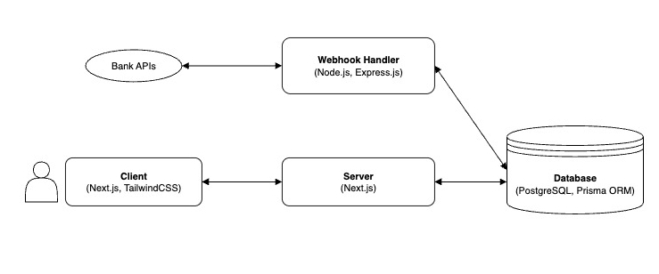

# Digital Wallet Application

## Overview

Architected and developed a secure digital wallet platform enabling users to on-ramp funds from bank accounts and perform real-time peer-to-peer wallet transactions.

## Key Highlights

- Designed and implemented a dedicated **Node.js (Express.js)** HTTP server to process **bank webhook** events for fund transfers, ensuring reliable updates to wallet balances.
- Utilized **transactional row-level locking** in **PostgreSQL (via Prisma ORM)** to ensure data integrity and **prevent race conditions** during concurrent balance updates.
- Engineered the front end with **Next.js, TypeScript, and TailwindCSS**, delivering a responsive and intuitive user interface for seamless wallet management.
- Employed a **monorepo architecture (Turborepo)** to streamline development workflows and improve modularity between front-end and back-end services.

## Tech Stack

- **Frontend:** Next.js, TypeScript, TailwindCSS
- **Backend:** Node.js, Express.js
- **Database:** PostgreSQL (Prisma ORM)
- **Architecture:** Monorepo (Turborepo)

## System Design

